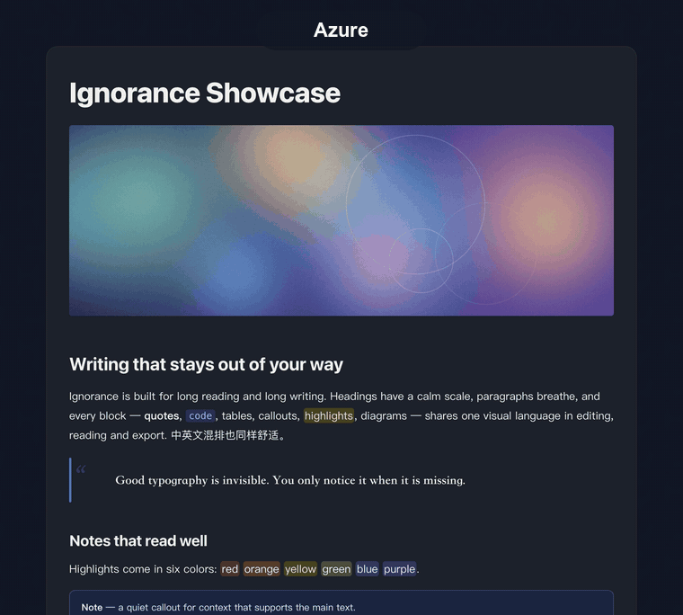
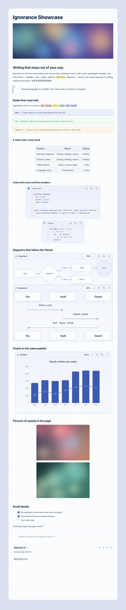

<div align="center">

# Ignorance

**为中英文长文写作而生的 Obsidian 主题：安静、耐读。**
八套配色 · 浅色与深色 · 编辑、阅读、导出和手机端一样用心。

[English](README.en.md) · [配套插件](https://github.com/ignorance-shiyao/obsidian-ignorance-advanced) · [支持作者](#支持)


**English:** Ignorance is a calm, highly readable Obsidian theme for long-form Chinese and English writing. It ships a consistent look for editing, reading, PDF export and mobile, with typography-first layout, a clear heading hierarchy, and styled quotes, tables, code blocks, callouts and highlights, in both light and dark. Eight color palettes are available through the optional companion plugin *Ignorance Advanced*. Full English documentation: [README.en.md](README.en.md).




</div>

## 多彩，随时切换

**八套配色**：Azure、Pine、Book、Graphite、Terracotta、Teal、Wisteria、Amber，每套都为浅色和深色分别调校。标题、链接、引用、高亮、标注块、表格都跟着配色走。切换配色由配套插件提供，主题本身默认 Azure。

## 随处一致

<div align="center">

| 浅色 | 深色 |
| :---: | :---: |
|  |  |

</div>

## 特点

- **排版优先**：系统字体（苹方 / 微软雅黑）、820 px 阅读栏、宽松行高、清晰的 H1–H6 层级，实时预览、阅读视图和导出保持一致。
- **讲究的内容块**：粗竖线引用、表头更醒目并带浅色斑马纹的表格、带标题栏/行号/语法着色的代码块、多种色调的标注块、圆形任务复选框、脚注，以及跟随 Obsidian `--highlight-background-*` 变量的六色高亮。
- **浅色与深色一起设计**，对比度经过校准；也可以让 Obsidian 自带的强调色接管。
- **手机端**：更紧凑的间距、可横向滚动的表格、适合手指的控件。
- **打印与 PDF**：自动隐藏侧栏和控件，导出与屏幕所见一致。
- **尊重你的设置**：遵循"减少动态效果"，以及你的字体与字号选择。

## 安装

**在 Obsidian 内**：设置 → 外观 → 主题 → 管理 → 搜索 "Ignorance" → 安装并使用。*（主题通过审核后）*

**手动安装**：从[最新发布](https://github.com/ignorance-shiyao/obsidian-ignorance/releases/latest)下载 `theme.css` 与 `manifest.json`，放入 `<库>/.obsidian/themes/Ignorance/`，然后在 设置 → 外观 选择 *Ignorance*。

## 推荐：配套插件

主题可独立使用。再装 **[Ignorance Advanced](https://github.com/ignorance-shiyao/obsidian-ignorance-advanced)** 可获得配色切换、Mermaid 与 ECharts 增强、表格与图片工具、分页阅读、演示（PPT 视图与 PPTX 导出）和多种导出。

## 说明

- 不内置字体；回退字体为 Noto Sans CJK SC。
- 自带视图的第三方插件可能保留自己的样式。
- `docs/style-check.md` 覆盖所有元素，可复制到库里检查主题效果。

## 开发

```bash
scripts/install-to-vault.sh /path/to/vault   # 把 theme.css 和 manifest.json 拷进库
```

## 支持

如果你喜欢这个主题，欢迎请我喝杯咖啡，谢谢！

| 微信 | 支付宝 |
| --- | --- |
|  |  |

## 许可

[MIT](LICENSE)。
